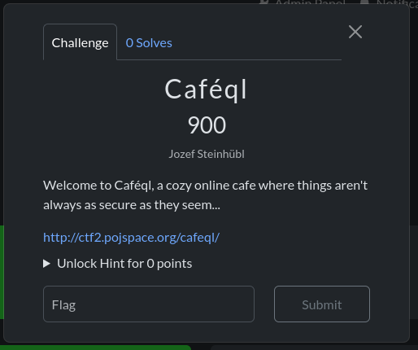
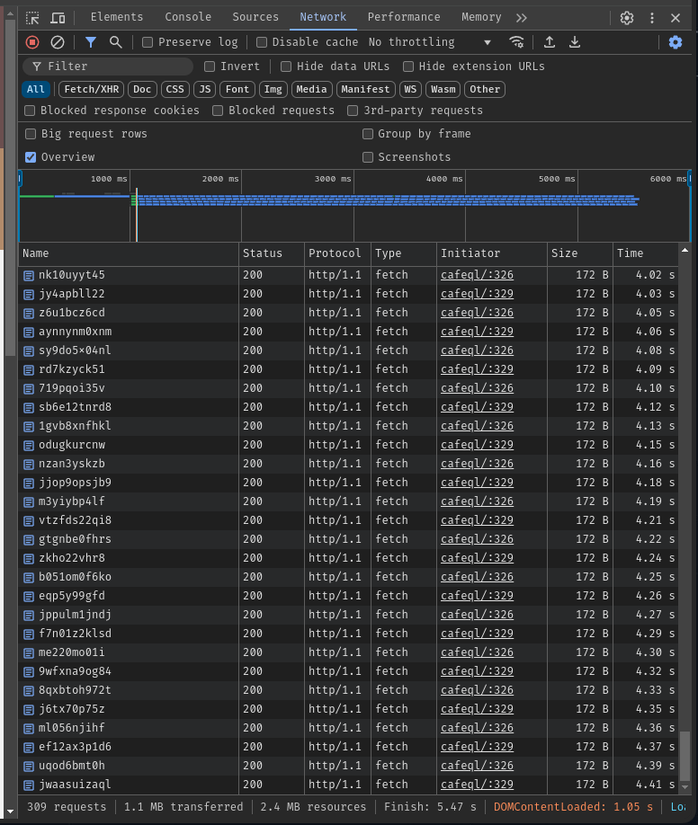
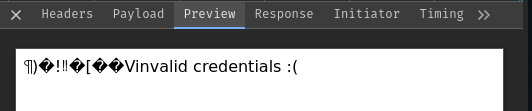

## Introduction



In this challenge, we got a link to a website about coffee.

## Investigation

After opening the website, we can see a lot of requests being made to the server:


But in the elements tab, we can't neither see the script nor link to the script that is being executed. Maybe the script is deleted after being
executed?

## Solution

In the sources tab, we can see this script:

```javascript
const fakeLogin = generateFakeRequestUrl().slice(4);
const loginUrl =
  (window.url || window.location.href) +
  `ca${fakeLogin.slice(0, 3)}x${fakeLogin.slice(4, fakeLogin.length)}fe`;

function generateFakeRequestUrl(prefix) {
  const randomString = Math.random().toString(36).substring(2);
  const randomNum = Math.floor(Math.random() * 1000);
  return `${prefix ? window.url || window.location.href : ""}${randomString}`;
}

const maxI = 150;
const randomNum = Math.floor(Math.random() * maxI);
for (let i = 0; i < maxI; i++) {
  fetch(generateFakeRequestUrl(), {
    method: "OPTIONS",
  });
  fetch(generateFakeRequestUrl());

  if (i == randomNum) {
    fetch(loginUrl, {
      method: "OPTIONS",
      headers: {
        "Content-Type": "application/json",
      },
      body: JSON.stringify({
        username: "admin",
        password: "secretcafeadmin",
      }),
    });

    fetch(loginUrl, {
      method: "POST",
      headers: {
        "Content-Type": "application/json",
      },
      body: JSON.stringify({
        username: "admin",
        password: "secretcafeadmin",
      }),
    });
  }
}

document.querySelector("#login-script").remove();
```

This script generates a fake login URL and sends a lot of requests to the server to hide the real login request. The real login request is sent
when `i == randomNum`. The login URL is

```javascript
ca${fakeLogin.slice(0, 3)}x${fakeLogin.slice(4, fakeLogin.length)}fe
```

and method is `POST` or `OPTIONS`, we don't know yet.

However, in the network tab, when we sort the requests by size, we can see that the login request is the biggest one with exactly 257 bytes. It's a `POST` request with the following body:

```json
{
  "username": "admin",
  "password": "secretcafeadmin"
}
```



### How to get the credentials?

The **ql** in Café**ql** is a hint that the website uses some kind of SQL database. We can try to use SQL injection to get the credentials.

We can try to use `' OR 1=1 --` as the password to see if we can get the credentials. And voilà, we got the flag.
