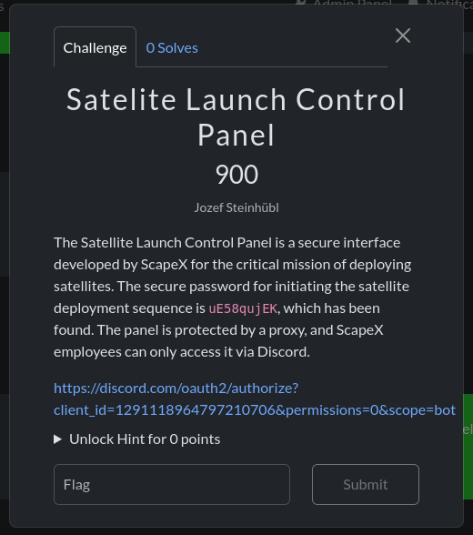
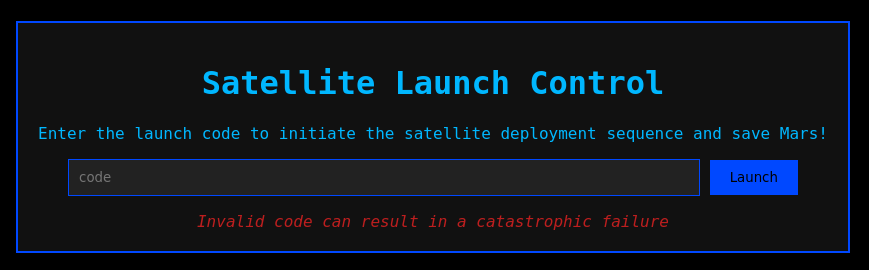
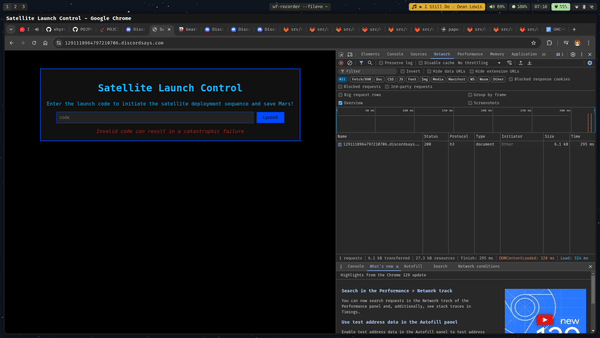

## Introduction

In this challenge, we got a link to a discord bot that we can use to invite it to our server. The main issue is that after trying to invite the bot, we get an error saying that the integration is private.

## Investigation

With discord applications we can do two things, we can create a bot or [custom voice activity](https://discord.com/developers/docs/activities/building-an-activity). In this case, since we can't invite the bot, we can try starting
the voice activity. However, the bot can't be invited to the server, so how can we start it?

## Solution

In the disDiscordveloper documentation, we can find multiple mentions about where the voice activity is exposed.

- https://discord.com/developers/docs/activities/development-guides#construct-a-full-url
- https://discord.com/developers/docs/activities/development-guides#preventing-unwanted-activity-sessions
- https://discord.com/developers/docs/change-log#activities-proxy-csp-update

It`s possible to prevent unwanted activity sessions, but perhaps the challenge creator forgot to do it. As mentioned, each discord activity can be accessed
using `<clientid>.discordsays.com` thus we can access the voice activity on [1291118964797210706.discordsays.com](https://1291118964797210706.discordsays.com).

After accessing the link, we can see the satellite launch control panel:

Now, we can just open the network tab, put the deployment code in the input and click on the `Submit` button. After that, we got the flag.

