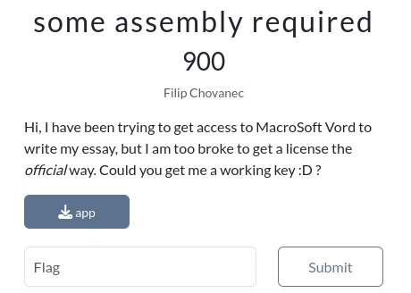
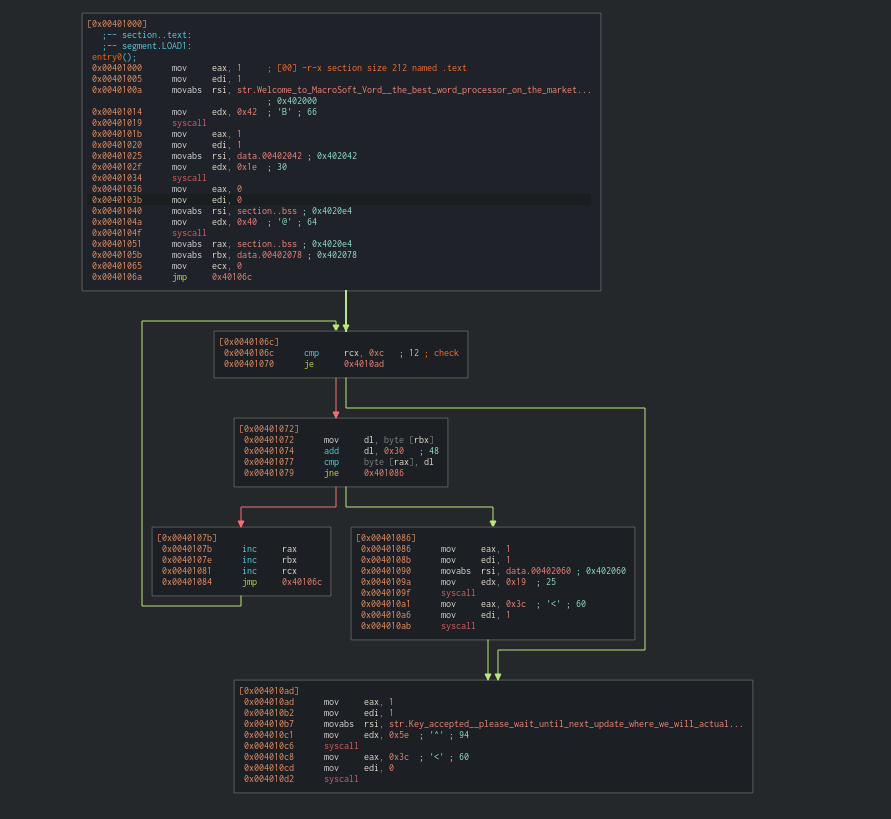
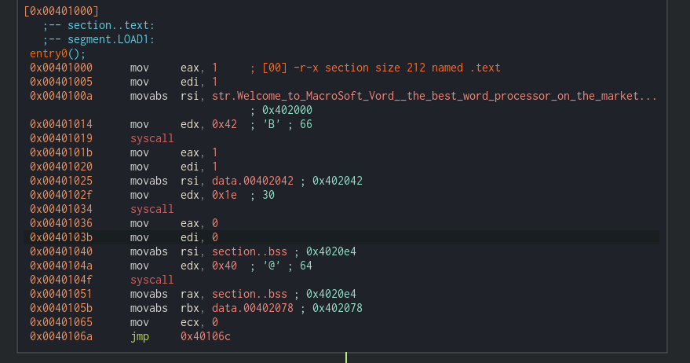
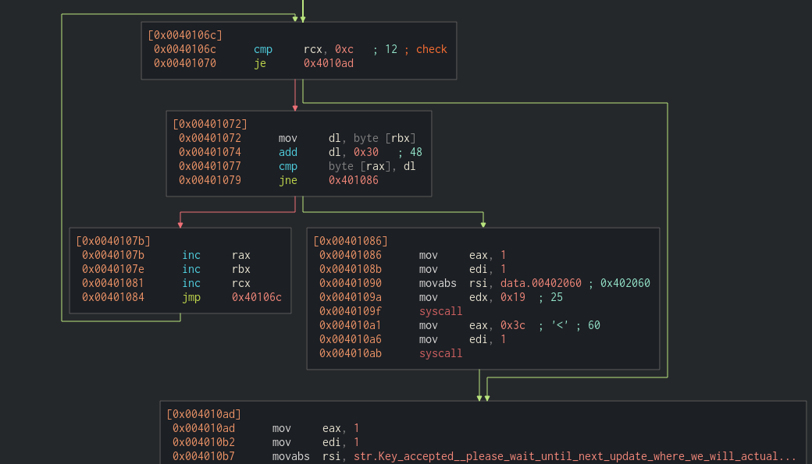

# Introduction


Judging from the challenge description, we recieve an `app` that we must find a password to, which it valides. Once we find it, that should be our flag. Lets try and run it:

```sh
$ chmod +x app
$ ./app 
Welcome to MacroSoft Vord, the best word processor on the market!
Please enter your product key:adminispasswordforsure
Incorrect key, aborting
```

# Analysis
I like to use [Cutter](https://cutter.re/) for reverse engineering, so boot it up and open `app` in it. Looking at it from graph view:



We have some kind of initial block, then a loop and finally an end. Lets look at them one by one.

## Initial block


There is a bunch of linux syscalls, followed by some register setting and a jump to the loop. There used to be cheatsheet I would use long ago, sadly I cant find it, so [this](https://thevivekpandey.github.io/posts/2017-09-25-linux-system-calls.html) will do for you.

1. First syscall uses `write` to `stdout`, for the first message
2. Second syscall writes the second message
3. Third syscall reads the standard input and stores it somewhere on `.bss`
4. Register A is set to a pointer to this input. Register B is set to a pointer to some data in the app. Finally, register C is set to 0 and we jump to the loop

## Loop


### endcheck
The first block checks if C is equal to 12; if so, it jumps to the last "success" block. If not we continue the loop.

### corrector
- The second block reads the character stored at the address of B(data) to D. 
- Then it adds 48 to it. 
- Lastly, it compares it to the character at A(input)
- If they are same, we jump to the increment block
- If not we jump to the failure block

### failure
Consists of 2 syscalls, one prints the failure message, while the other exits the program

### Increment
this one just adds +1 to A, B and C


## Making sense of it all

Alright, so A stores our input, B some kind of list of numbers, C is a counter. Every cycle we increase C, and when it reaches 12 we have succesfully passed all test and win. A and B are also increased each cycle so they point to their next respective character in their list. If at any point `*A != *B + 48`, the input is marked as invalid. In other words, we need to pass a 12 byte string, where each character must be equal to B minus 48. 

# Exploiting it
We just gotta read the values stored at the address loaded first into B (you can use Hexdump in Cutter). One cool property of ascii, is that you can add 48 to any digit to turn it into the same asci character, e.g. `1 + 48 = '1', 7 + 48 = '7'`. We do this for all 12, and voila! That is our flag.